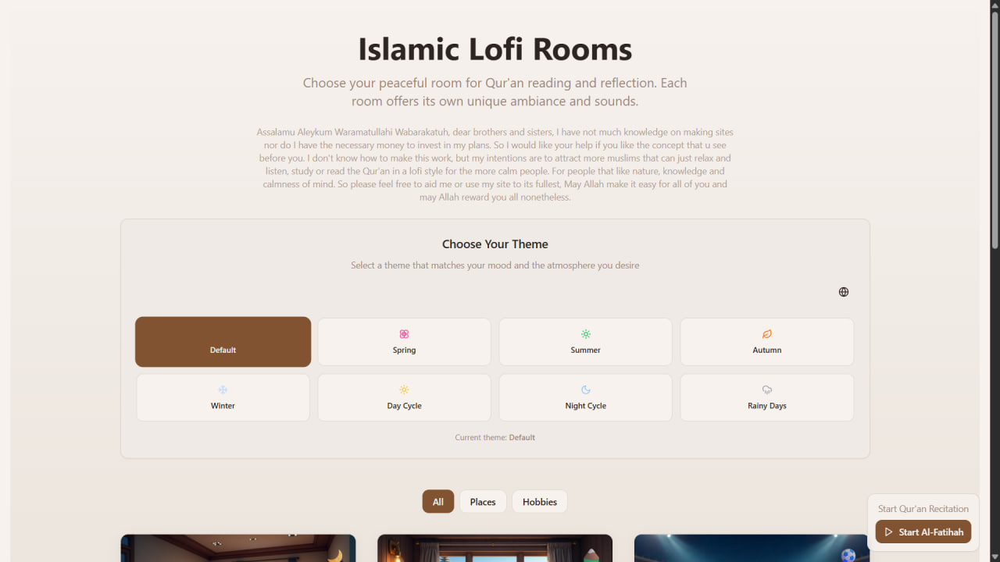
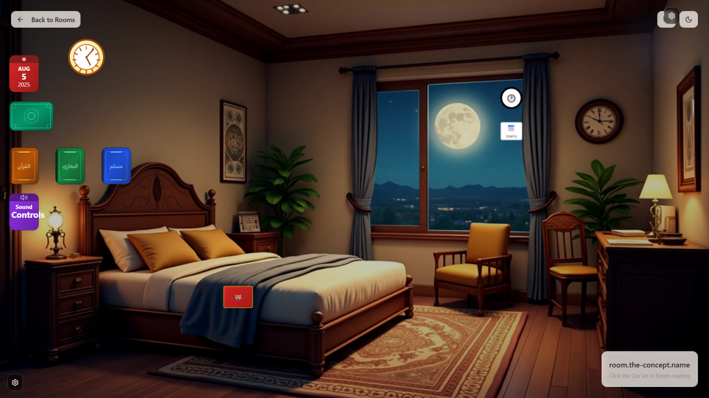

# Islamic Lofi Rooms

## About the Project

**Islamic Lofi Rooms** is a website for atmospheric Qur'an reading. Here you will find:
- A convenient and beautiful Qur'an reader
- Background sounds for relaxation and focus
- Unique rooms with different ambiances and sounds (rain, fire, sea, forest, etc.)
- Widgets for reading, reminders, calendar, and more

Each room is a separate world with its own mood, where you can read, listen to, or study the Qur'an in a calm environment.

## Main Features
- **Qur'an reading** with a user-friendly interface
- **Background sounds**: rain, fire, forest, sea, and more
- **Room selection** with unique ambiances and sounds
- **Widgets**: calendar, prayer times, hadiths, reminders
- **Themes** (day, night, seasons)
- **Multilanguage support**
- **Abdul Basit recitation** with verse-by-verse audio and synced highlighting

## Features implemented in our work
- **Added background audio playback function** — added the function for background sound playback
- **Corrected functionality and appearance of room widgets** — fixed the functionality and appearance of room widgets

---

> To run the project:
> 1. Install dependencies: `npm i`
> 2. Start locally: `npm run dev`
> 3. Optional: install `lovable-tagger` for component tagging during development

The PostCSS configuration will use `@tailwindcss/postcss` when available and fall back to `tailwindcss` otherwise, so either plugin works out of the box.

It is also necessary to install the folder with audio of all the Ayats from the Quran from the link - https://drive.google.com/file/d/1Hu18XEnVbGfjLoI6yiVXtbs9-onQcnh2/view?usp=sharing

---

**This site is created for peaceful and thoughtful Qur'an reading with maximum comfort and atmosphere.**
